# DILEEP BODDU

<picture>
  <source media="(prefers-color-scheme: dark)" srcset="./dark.svg">
  <source media="(prefers-color-scheme: light)" srcset="./light.svg">
  
</picture>

## About

I'm **Dileep Boddu**, an **AI / ML Engineer** based in Visakhapatnam, Andhra Pradesh, India.

My work focuses on **AI/ML, deep learning, data science, and agentic AI**, with practical projects in prediction, computer vision, NLP, and AI-powered applications.

## Focus

AI / ML · Deep Learning · Data Science · Agentic AI · Computer Vision · NLP

## Experience

**Python Intern — DataPro Institution**  
May–July 2024

## Education

**BCA — Data Science**  
Gayatri Vidya Parishad College · 2022–2025

## Featured Projects

### Eco Drive AI
Agentic vehicle carbon-footprinting and eco-driving system with multi-agent analysis, ML-based fuel prediction, route analysis, driving analysis, and carbon-impact calculations.

### AQI Prediction
Machine-learning application for air-quality prediction and health-impact analysis using pollutant and meteorological data.

### Image Caption Generator
CNN + LSTM image-captioning system using VGG16 and the Flickr8k dataset.

## Engineering Stack

**Languages:** Python · C · R · SQL · Java · JavaScript

**AI / ML:** Machine Learning · Deep Learning · CNN · LSTM · NLP · TensorFlow · Keras · PyTorch · scikit-learn

**Web / Backend:** React.js · HTML/CSS · FastAPI · Uvicorn

**Tools:** Git · GitHub · PyQt5 · Google ADK · Joblib

## Connect

- [GitHub / Portfolio Repository](https://github.com/Dileep212-y/My_Protofolio/tree/main)
- [Portfolio](https://dileep212-y.github.io/My_Protofolio/?utm_source=chatgpt.com)
- Email: dilrockstardj@gmail.com
